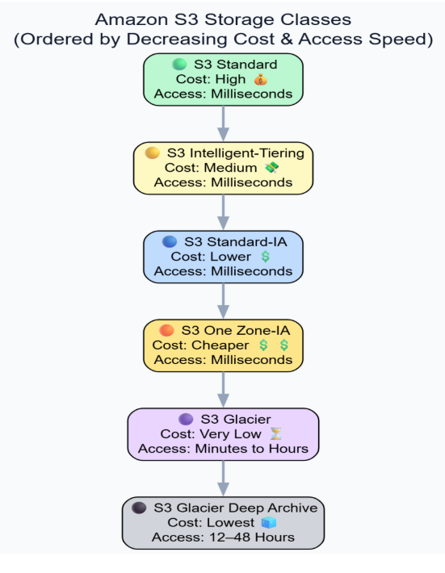

## Cloud Storage(S3 bucket)

It is Software as a service.

Amazon S3 is a **cloud object storage service** used to store, access, and backup large amounts of data over the internet. Service that helps to store, access and backup unstructured data like photos videos. It is a regional service.

It is designed for:

1. high durability
2. high availability
3. scalability
4. security

# What is Cloud Object Storage?

In object storage, data is stored as **objects** instead of blocks or files.

Each object contains:

```
Data
Metadata
Unique identifier
```

Structure of S3 storage:

```
AWS S3
   ↓
Bucket
   ↓
Object
```

# Key Components of Amazon S3

## 1. Bucket

A **bucket** is the top-level container used to store objects.

Example:

```
my-photo-bucket
```

Bucket characteristics:

- globally unique name
- created in a specific region
- can contain unlimited objects

Example:

```
Bucket: anjali-project-storage
```

---

## 2. Object

An **object** is the actual file stored inside a bucket.

Examples:

- PDF
- CSV
- images
- ML models
- videos

Each object contains:

```
Data
Metadata
Key
```

Example:

```
hello.txt
report.pdf
video.mp4
```

---

## 3. Key

A **key** is the unique name of an object inside a bucket.

Example:

```
bucket: project-files
object key: report.pdf
```

Full path example:

```
project-files/report.pdf
```

# Durability and Availability

Amazon S3 provides extremely high durability.

Durability:

```
99.999999999% (11 nines)
```

This means data loss probability is extremely low.

AWS achieves this by **replicating data across multiple availability zones.**

---

# Security Features of S3

S3 includes multiple security mechanisms.

#### Encryption

Data can be encrypted at rest, in transit.

Encryption methods are-

1. SSE-S3
2. SSE-KMS
3. client-side encryption

---

### Access Control

S3 supports access control mechanisms:

1. IAM policies
2. bucket policies
3. access control lists (ACL)

Example:

```
Allow user to read objects
but deny delete permission
```

# Amazon S3 Storage Classes

S3 provides different storage classes optimized for cost and performance.

| Storage Class  | Cost               | Purpose             | Access Speed |
| --- | --- | --- | --- |
| S3 Standard  | High  |  Frequently accessed data  | Milliseconds |
| S3 Intelligent-Tiering  | Medium  | Data with unknown or
changing access patterns | Milliseconds |
| S3 Standard-IA | Lower | Infrequently accessed but
important, low latency, frequency | Milliseconds |
| S3 One Zone-IA | Cheaper | Infrequent, non-critical
data | Milliseconds |
| S3 Glacier  | Very Low | Archive — access in
minutes/hours Minutes to hours | Minutes to hours |
| S3 Glacier Deep | Lowest | Cold storage — long-term
archive | 12-48 hours |



→ S3 can change and deploy the static websites

---

# Static vs Dynamic Websites

#### Static Website

Content is fixed and does not change dynamically.

Example- Portfolio website, Company landing page, Documentation site

Characteristics:

1. no backend server
2. faster
3. cheaper

---

## Dynamic Website

Content changes based on user interaction.

Example- Login system, Online store, Social media

Dynamic websites require:

```
Server
Database
Application logic
```

---

# Remote Access Protocols

#### SSH (Secure Shell)

Used to connect to Linux servers.

Example:

```
ssh-i key.pem ubuntu@ip-address
```

## RDP (Remote Desktop Protocol)

Used to connect to Windows servers.

Example:

```
Remote Desktop Connection
```

---

# AWS Snow Family

AWS Snow services are used for **large-scale data migration** when internet transfer is slow.

Example use case can be Migrating TBs or PBs of data, Data center migration.

---

# Components of Snow Family

#### Snowcone

Small portable device. Used for Edge computing, Remote locations, Small data transfer.

Capacity-

```
GB → small TB
```

---

#### Snowball Edge

Large device for data transfer and edge computing.

Features-

1. supports EC2 instances
2. supports Lambda functions

Capacity- 

```
TB scale
```

---

#### Snowmobile

Used for **massive data migration**. Snowmobile is literally a **truck containing data storage systems**. Used in Entire data center migration.

Capacity:

```
Petabytes to exabytes
```
